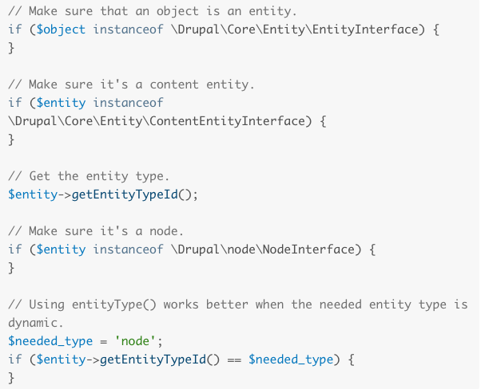
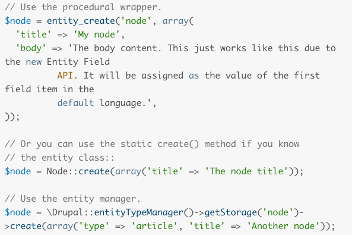
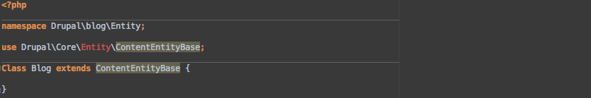
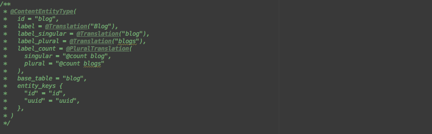

# Entity API
Note:
- Welcome everyone!

## Kalpana Goel
## http://drupal.org/u/kgoel
## http://twitter.com/kalpanagoel
Note:
- Introduction
- Why I am giving this session?

# What is an Entity?
## https://en.wikipedia.org/wiki/Entity
Note:
- You might have used in Drupal 7 if you used Drupal in your project.
- Let's discuss first what is an entity as a refresher.
- As per wikipedia- Entity is something that exists as itself as a subject or object.
- Wikipedia link is here if anyone would like to read more about it.

# Types of Entity
## Nodes(content)
## Comments
## Files
## Taxonomy terms
## Vocabularies
## Users
## Custom entity
Note:
- In earlier version of Drupal, we used field api to create content type but now we can add fields to not only content type
- but we an add them to comment, taxonomy
- We have different types of entity.

## Bundles
## Fields
Note:
- Bundles are implementation of entity types to which fields can be attached.
- Bundles can be considered as sub content types.
- For example - article, news releases, blog are bundles of content(node) type.
- not all entities has bundle types like users
- Fields are reusable piece of content. You can create custom field, custom formats, widgets etc
- Fields can be attached to bundles or entities.

## Entity
## api.drupal.org/api/drupal/core!lib!Drupal!Core!Entity!entity.api.php/group/entity_api/8.2.x
Note:
- We are back to our original question.. what is entity?
- Entity is one instance of a particular entity type such as comment, taxonomy term, user or blog, article (bundles)
- Entity API was it's own module in Drupal 7
- Entity api is in Drupal 8 core.
- Link is for latest Drupal 8 core which is 8.2.x
- You can read more about entity at this link

# Entity Variants
## Configuration Entity
## Content Entity
Note:
- Entity type in cores comes in two variants
- Configuration entity is used in the configuration system.
- What is configuration? Configuration is a place to store information that you want to deploy from dev to prod
- like configuration entities (example - views, content types, vocabularies)
- Configuration entity supports translation.
- Content entity consists of configurable and base fields, can have revisions and supports translation.

# Entity Handlers
## Storage Handler
Note:
- What are handlers?
- Entities are supported by handlers.
- Storage handler supports loading, saving, and deleting entities.
- Storage handlers include default support for revisions, translations, and configurable fields.
- Does storage handler only support content entity since it includes support for revisions snd configurable fields.

## Check
## 
Note:
- Entity API in D8 is powerful
- It allows us to run different checks
- You can run check to make sure if an object is an entity
- If it is a content entity
- You can get the entity type
- Check if it is a node
- Explain the last one?

## Entity methods
## 
Note:
- There are a number of generic methods are available to get information from an entity
- You can get the ID
- get bundle
- Check if entity is new
- get the label of entity
- Create a duplicate that can be saved as a new entity

## Create entity
## 

## Custom entity
## Blog content type
## <pre><code>
   name: Blog
   type: module
   core: 8.x
</pre></code>
Note:
- We are creating blog content type as a custom entity
- First step... create folder modules/blog
- create blog.info.yml

## Entity class
## <pre><code>
<?php

namespace Drupal\blog\Entity;

use Drupal\Core\Entity\ContentEntityBase;

Class Blog extends ContentEntityBase {

} </code></pre>
## 
Note:
- Blog entity is instance of the entity class
- entity class in d8 resides in modules/<module_name>/src folder
- We have blog entity in src folder
- In d8, src directory has all OOP code like class, interfaces, traits
- Procedural code is in .module file outside src directory
- We have /src/Entity/Blog.php
- Let's take a look at the code
- We have namespace which allows code from different frameworks like Symfony, Drupal
- Namespace has multiple parts. All classes in core and modules have Drupal as top level namespace
- second part contain name of the module
- third part corresponds to the folder inside src folder

## Annotations
## 

Note:
- Annotations provides metadata about the code.