# Entity API
Note:
- Welcome everyone!

## Kalpana Goel
## http://drupal.org/u/kgoel
## http://twitter.com/kalpanagoel
Note:
- Introduction
- Why I am giving this session?

## 

## 

## 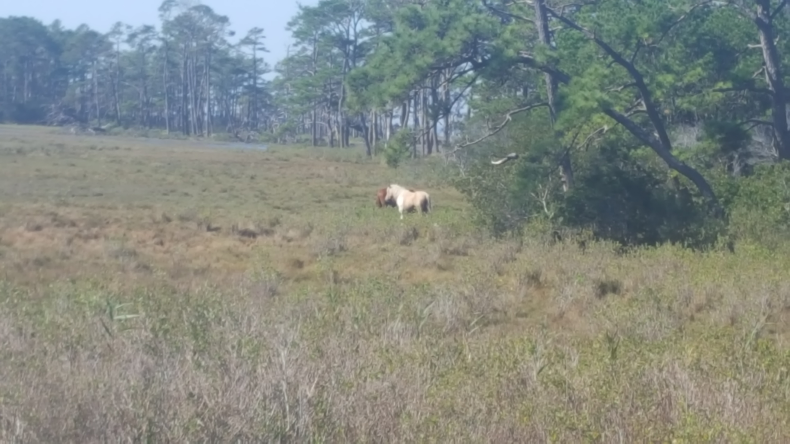

# What is an Entity?
## https://en.wikipedia.org/wiki/Entity
Note:
- You might have used in Drupal 7 if you used Drupal in your project.
- Let's discuss first what is an entity as a refresher.
- As per wikipedia- Entity is something that exists as itself as a subject or object.
- Wikipedia link is here if anyone would like to read more about it.

# Types of Entity
## Nodes(content)
## Comments
## Files
## Taxonomy terms
## Vocabularies (Config entity)
## Users
## Custom entity
Note:
- In earlier version of Drupal, we used field api to create content type but now we can add fields to not only content type
- but we an add them to comment, taxonomy
- We have different types of entity.

## Bundles
## Fields
Note:
- Bundles are implementation of entity types to which fields can be attached.
- Bundles can be considered as sub entity types.
- For example - article, news releases, blog are bundles of node entity type.
- not all entities has bundle types like users
- Fields are reusable piece of content. You can create custom field, custom formatters, widgets etc
- Fields can be attached to bundles or entity type.

## Entity
## http://api.drupal.org/api/drupal/core!lib!Drupal!Core!Entity!entity.api.php/group/entity_api/8.2.x
Note:
- We are back to our original question.. what is entity?
- Entity is one instance of a particular entity type such as comment, taxonomy term, user.
- Entity API was it's own module in Drupal 7
- Entity api is in Drupal 8 core.
- Link is for latest Drupal 8 core which is 8.2.x
- You can read more about entity at this link

# Entity Variants
## Configuration Entity
## Content Entity
Note:
- Entity type in cores comes in two variants
- Configuration entity is used in the configuration system.
- What is configuration? Configuration is a place to store information that you want to deploy from dev to prod
- like configuration entities (example - views, content types, vocabularies)
- Configuration entity supports translation.
- Content entity consists of configurable and base fields, can have revisions and supports translation.

# Entity Handlers
## Storage Handler
Note:
- What are handlers?
- Entities are supported by handlers.
- Storage handler supports loading, saving, and deleting entities.
- Storage handlers include default support for revisions, translations, and configurable fields.
- Does storage handler only support content entity since it includes support for revisions snd configurable fields.

## Check
## 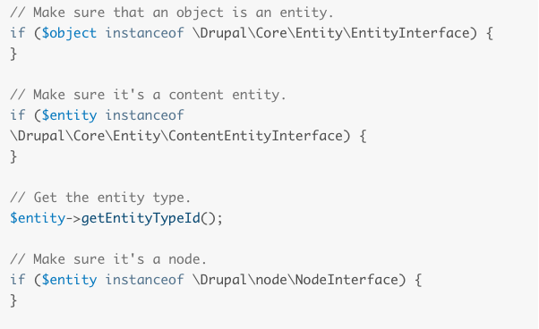
Note:
- Entity API in D8 is powerful
- It allows us to run different checks
- You can run check to make sure if an object is an entity
- If it is a content entity
- You can get the entity type
- Check if it is a node

## Entity methods
## 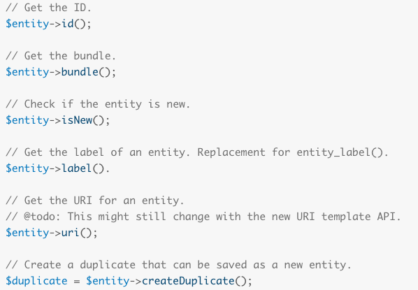
Note:
- There are a number of generic methods are available to get information from an entity
- You can get the ID
- get bundle
- Check if entity is new
- get the label of entity
- Create a duplicate that can be saved as a new entity

## Custom entity
### Event entity type
### 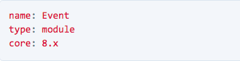
Note:
- We are creating event content type as a custom entity
- First step... create folder modules/event
- create event.info.yml
- Install event module

## Entity class
## 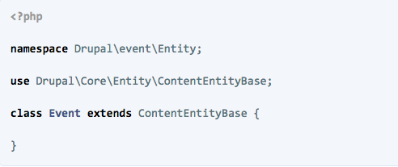
Note:
- Event entity is instance of the entity class
- entity class in d8 resides in modules/<module_name>/src folder
- We have event entity in src folder
- In d8, src directory has all OOP code like class, interfaces, traits
- Procedural code is in .module file outside src directory
- We have /src/Entity/Event.php
- Let's take a look at the code
- We have namespace which allows code from different frameworks like Symfony, Drupal to be used simultaneously without risking naming conflicts.
- Namespace has multiple parts. All classes in core and modules have Drupal as top level namespace
- second part contain name of the module
- third part corresponds to the folder inside src folder
- extends Base classes can be used to implement functionality that is generic and useful for many classes.
- Classes can inherit all functionality from such a base class by using the extends keyword.
- Content entities are entities that are created by site users.
- They are typically stored in the database, often with a auto-incrementing integer ID.
- ContentEntityBase class also belongs to a namespace.
- Thus, in order to use it below, we need to import the class using the full namespace.

## https://api.drupal.org/api/drupal/core%21core.api.php/group/oo_conventions/8.2.x
Note:
- Follow the link to see OOP conventions in Drupal 8.2.x
- This link talks about PSR-4, namespaces, class naming, and other conventions.

## Annotations
## 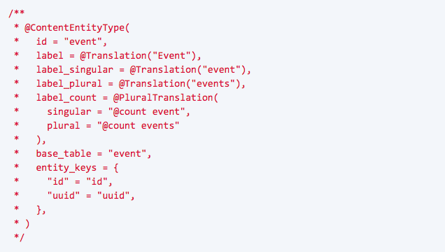
Note:
- Annotations provides metadata about the code.
- annotations are taken from doctrine project and Drupal adopted it.
- Because the annotation is placed right next to the code itself,
- this makes classes truly self-contained as both functionality and metadata are in the same file.
- Even though the annotation is part of a comment block, it is required for the entity type to function.
- Let's take a look
- ID is ID of the entity type which is needed.
- Provided different labels for different possible usages
- Because the label of this entity type might be used in a sentence and when referencing multiple entities we need to provide different labels for the different possible usages.
- We make annotations translatable by wrapping them into @Translation or @PluralTranslation
- Along with the label, we have provided storage information in base table
- We are providing database table(base table) we want event data to be stored.
- Entities are required to have an ID which they can be loaded by.
- ID and UUID are database columns
- UUID to make it easier to track content because it will be same in each environment

## https://api.drupal.org/api/drupal/core%21core.api.php/group/annotation/8.2.x
Note:
- Link if you would like to read more about annotations.

## Install event entity
## <pre><code> drush entity-updates </code></pre>
Note:
- We have our event entity class and annotations
- Let's install event entity
- drush entity-updates (only need to run if module is already installed)
- by running this drush command, drupal will crate database schema for our event entity
- If you check db, you will see event table in the database.

## Create and save event entity
## 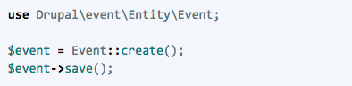
Note:
- for creating, saving, deleting entity type, we are going to use drush
- You can either use drush core-cli or create a test.php script and then running drush php-script test.php
- What does drush core-cli do?
- It opens interactive shell.
- This command creates new event entity in db and you will see a new row with id and uuid
- Let's explore the code
- Event class inherits create and save method from ContentEntityBase
- These methods can be inherited without being present in the event class
- create is a static method and it is called by using the class name and ::syntax
- save is not a static method so it is used with instance of the class and -> syntax

## Load event
## 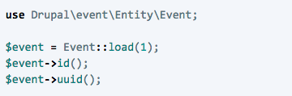
Note:
- loading event entity from db
- Notice load(1) . it expects some value and since it is expecting incremental value hence 1
- loading event by fetching ID and UUID

## Delete event
## 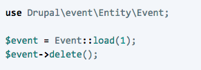
Note:
- Deleting event will result in deleting record from db

## Add fields
## 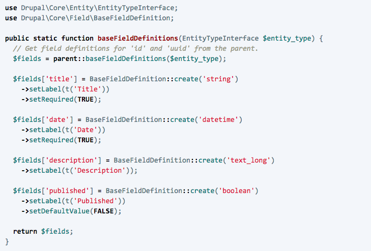
Note:
- Let's add some fields to event entity
- Fields are the pieces of data that make up an entity.
- To be able to store actual event data in our entities, we need to declare additional fields.
- We have the following code in /src/Entity/Event.php
- We are using type hint in the method EntityTypeInterface $entity_type
- EntityTypeInterface is type hint. Type hint indicates what type of object should be passed in the function
- Our event class is extending ContentEntityBase which has baseFieldDefinitions method
- this method provides id and uuid fields.
- As you can see... we are adding title, description and published fields
- Passing static create method to create fields

## Chaining
## 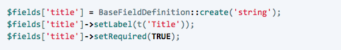
## 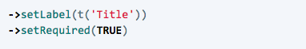
Note:
- To set up title field, we can first create text field, add label, and make it required field.
- Three line of code
- Or we can chain multiple setter methods one after the other.
- Not sure if chaining method is good but Drupal 8 core uses a lot.

## https://api.drupal.org/api/drupal/core%21lib%21Drupal%21Core%21Field%21Annotation%21FieldType.php/class/annotations/FieldType/8.2.x
Note:
- List of all field types in Drupal 8 core

## Install fields
## <pre><code>
drush entity-updates
</code></pre>
Note:
- We have added fields to our event entity
- let's install fields
- After running drush command, you will see title, description and published column other field in event table.

## Add format for a field
## 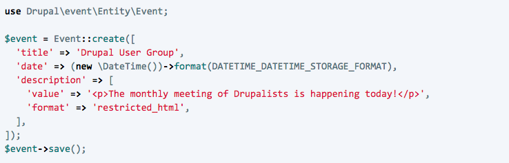
Note:
- So far we have added single property value fields.
- In this example, we are trying to add additional format property.
- This will create a new row in the event table with proper field values.

## Load event
## 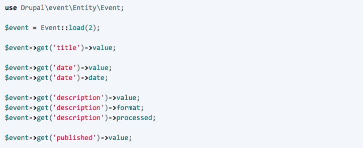
Note:
- Computed properties are properties of fields that are not stored but derived or computed to provide convenience for developers so they don't have to work with raw data directly
- such as the date property of a datetime field or the processed property of text fields.

## Add field methods
## 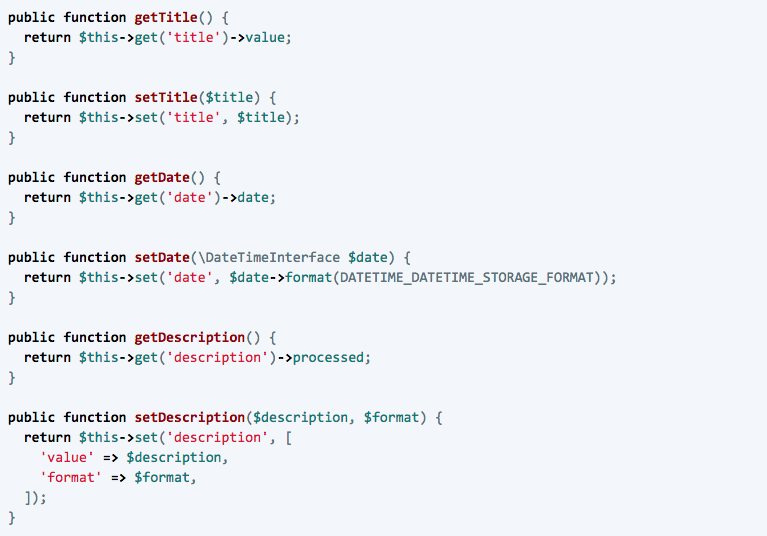
Note:
- Instead of relying on get and set methods, it is recommended to add field-specific method
- Add following methods in src/Entity/Event.php
- setDate() method, for example, hides the internal storage format of datetime values from anyone working with events.
- Similarly the setDescription() method requires setting the description and the text format simultaneously for security.

## Interface
## 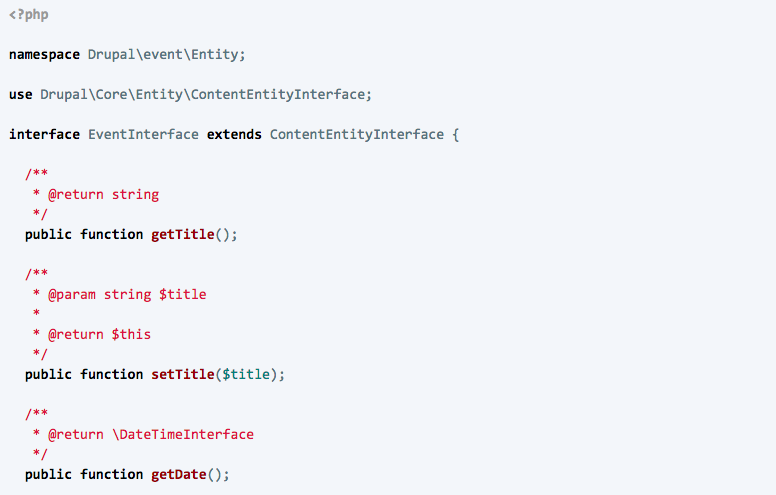
Note:
- src/Entity/EventInterface.php

## Viewing entities on a page
## 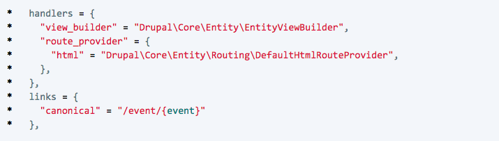
Note:
- Viewing an entity on a page requires a view builder that is responsible for constructing a renderable array from an entity object.
- a route is needed that utilizes the view builder to output the entity’s fields on a given path
- Add the following to the annotation in src/Entity/Event.php
- Entity handlers are objects that take over certain tasks related to entities
- Drupal core provides generic handlers that can be used as is
- when more advanced functionality is required, custom handlers can be used instead
- Instead of declaring routes belonging to entities in a *.routing.yml file like other routes,
- they can be provided by a handler, as well.
- Entity links denote at which paths on the website we can see an entity (or multiple entities) of the given type.
- Cache rebuild and navigate to event/{id} page
- code is incomplete because you will see access denied error

## Add an administrative permission
## 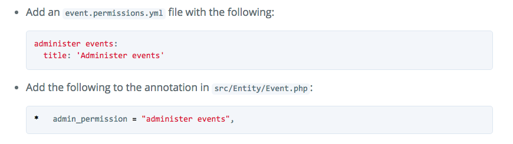
Note:
- rebuild cache
- visit event/{id} page and you will not see access denied error but ther is no field on the page

## Configure fields for display
## 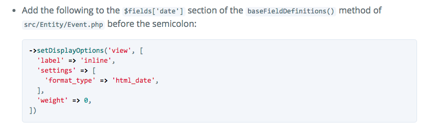
Note:
- Which fields to display when rendering the entity,
- as well as how to display them, can be configured as part of the field definitions.
- Display options can be set for two different display modes: view and form
- The respective values of the label setting are above, inline and hidden.
- Each field is displayed using a formatter.
- Weights allow the order of fields in the rendered output
- cache rebuild and fields will be shown.

## List of formatter class
## https://api.drupal.org/api/drupal/core%21lib%21Drupal%21Core%21Field%21Annotation%21FieldFormatter.php/class/annotations/FieldFormatter/8.2.x

## Listing entities
## Add administrative links
Note:
- You can do much more stuff with entities like display list of entities on a page
- You can add useful administrative links like provide menu link under content to add event
- view, delete and edit local task for event

## Contrib Module
### https://www.drupal.org/project/entity
Note:
- This module extends the entity API of Drupal core in order to provide a unified way to deal with entities and their properties.
- It is mostky a UI for revisions

## https://www.drupal.org/project/entityqueryapi
Note:
- It fills the gap between Drupal 8's built-in RESTful Services and Views with an easy to use.
- out-of-the-box means for loading, filtering and paging entities in a RESTful style.

## https://www.drupal.org/project/entitycache
Note:
- This is D7 version of the module
- Entity cache puts core entities into Drupal's cache API.

## Useful links
## https://www.drupal.org/docs/8/api/entity-api
## https://www.drupal.org/docs/8/api/entity-api/introduction-to-entity-api-in-drupal-8

## Credit
## Tobias Stoeckler
### https://www.drupal.org/u/tstoeckler

## Thank you!

